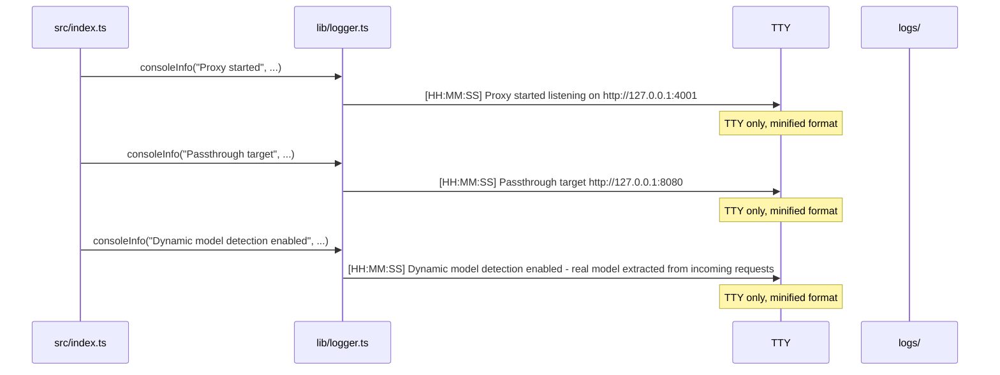
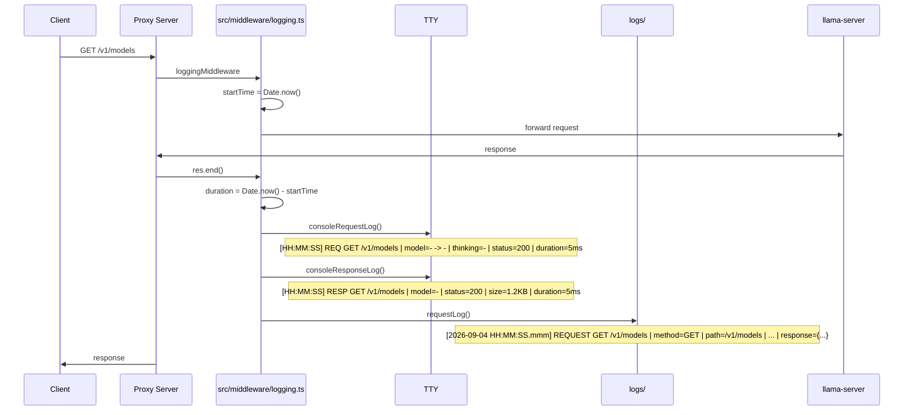
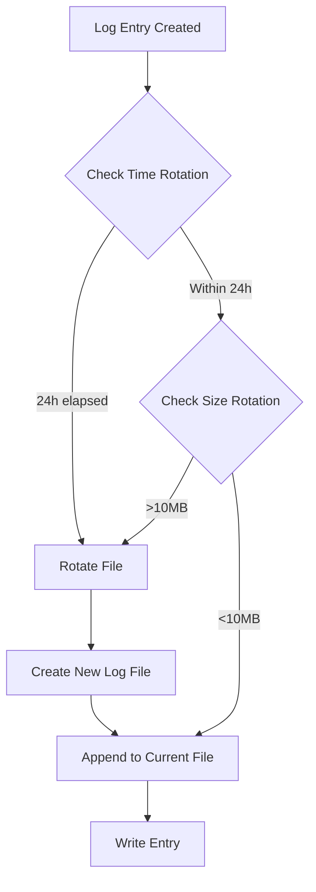

# Logging Flows

## Server Startup Flow



## Request/Response Logging Flow (Passthrough)



## Logging Function Comparison

### Console Request Log

```
Input:
{
  method: "GET",
  path: "/v1/models",
  incomingModel: undefined,
  upstreamModel: "-",
  thinking: undefined,
  status: 200,
  duration: 5
}

Output (TTY):
[HH:MM:SS] REQ     GET    /v1/models | model=- -> - | thinking=- | status=200 | duration=5ms
```

### Console Response Log

```
Input:
{
  method: "GET",
  path: "/v1/models",
  model: undefined,
  status: 200,
  size: 1234,
  duration: 5
}

Output (TTY):
[HH:MM:SS] RESP    GET    /v1/models | model=- | status=200 | size=1.2KB | duration=5ms
```

### File Request Log

```
Input:
{
  method: "GET",
  path: "/v1/models",
  incomingModel: undefined,
  upstreamModel: "-",
  thinking: undefined,
  status: 200,
  duration: 5,
  requestPayload: {},
  responsePayload: {"object":"list","data":[...]}
}

Output (File):
[2026-09-04 HH:MM:SS.mmm] REQUEST GET /v1/models | method=GET | path=/v1/models | incoming=- | upstream=- | status=200 | duration=5ms | request={} | response={"object":"list","data":[...]}
```

## Log Rotation Flow



## Error Handling Flow

```mermaid
sequenceDiagram
    participant App as src/index.ts
    participant Logger as lib/logger.ts
    participant File as logs/

    App->>Logger: info("Fatal error", message)
    Logger->>Logger: queueLog({level: "ERROR", message, details})
    Logger->>Logger: flushQueue()
    Logger->>File: appendFile(logFile, formattedEntry)
    Note over File: Error logged to file only (not TTY)