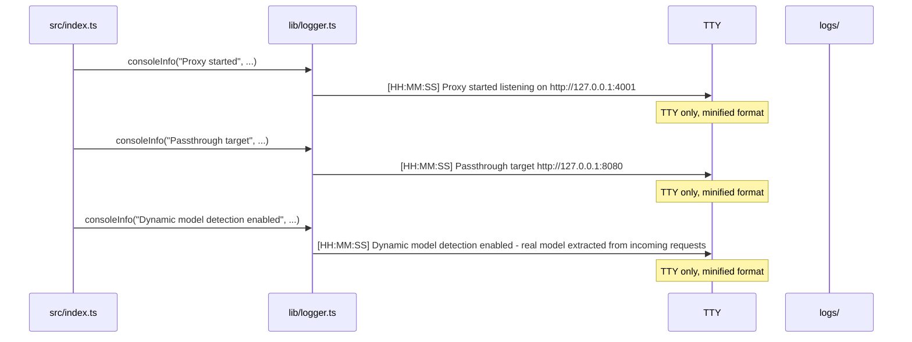
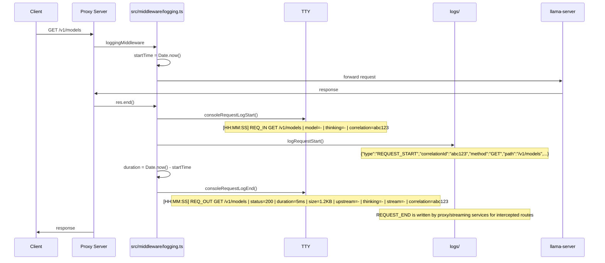
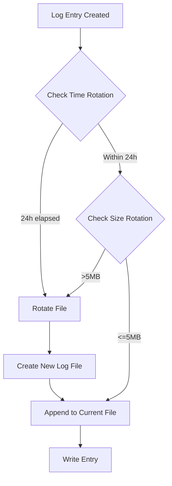
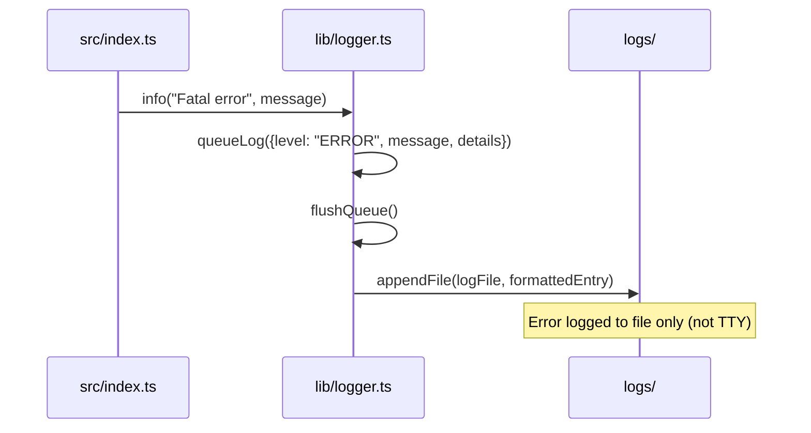

# Logging Flows

## Server Startup Flow



## Request/Response Logging Flow (Passthrough)



## Logging Function Comparison

### Console Request Start Log

```
Input:
{
  method: "GET",
  path: "/v1/models",
  incomingModel: undefined,
  thinkingMode: undefined,
  correlationId: "abc123"
}

Output (TTY):
[HH:MM:SS] REQ_IN  GET   /v1/models | model=- | thinking=- | correlation=abc123
```

### Console Request End Log

```
Input:
{
  method: "GET",
  path: "/v1/models",
  status: 200,
  duration: 5,
  size: 1234,
  upstreamModel: undefined,
  thinkingMode: undefined,
  stream: undefined,
  correlationId: "abc123"
}

Output (TTY):
[HH:MM:SS] REQ_OUT GET   /v1/models | status=200 | duration=5ms | size=1.2KB | upstream=- | thinking=- | stream=- | correlation=abc123
```

### File Request Start Log

```
Input:
{
  "timestamp": "2026-10-04 04:54:01.123",
  "type": "REQUEST_START",
  "correlationId": "abc123",
  method: "GET",
  path: "/v1/models",
  incomingModel: undefined,
  upstreamModel: undefined,
  thinkingMode: undefined,
  stream: false,
  requestPayload: {}
}

Output (File):
{"timestamp":"2026-10-04 04:54:01.123","type":"REQUEST_START","correlationId":"abc123","method":"GET","path":"/v1/models","stream":false,"incomingModel":null,"upstreamModel":null,"thinkingMode":null,"requestPayload":{}}
```

## Log Rotation Flow



## Error Handling Flow

