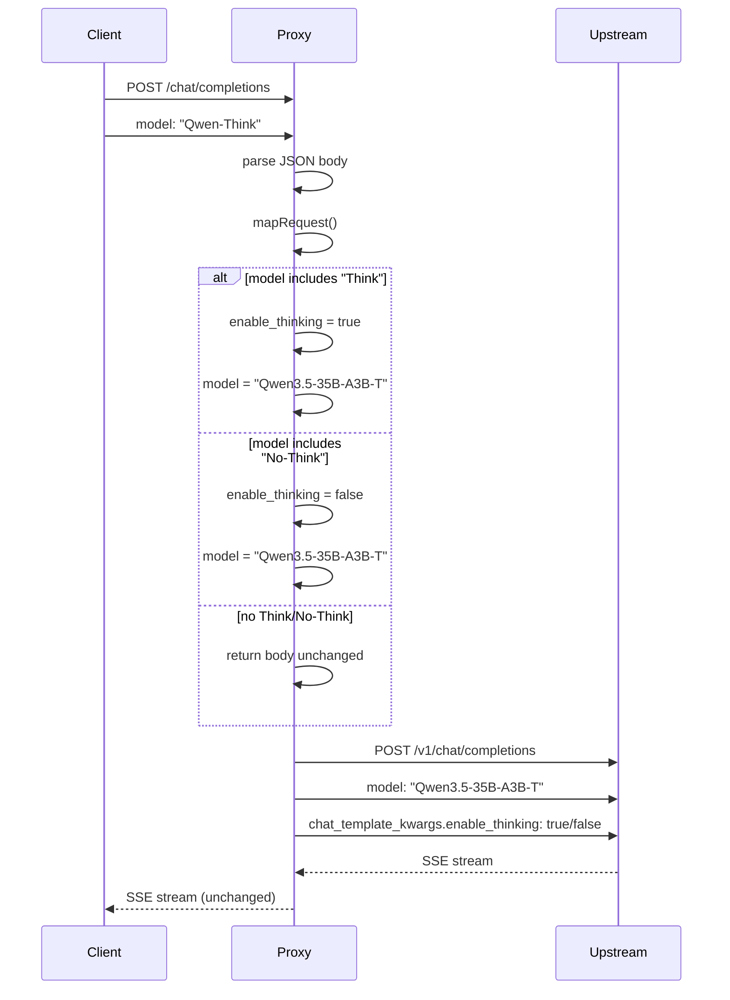

# Model Mapping Flow

## Sequence Diagram

## Step-by-Step Execution

1. **Client Request**
   - Client sends POST to `/chat/completions`
   - Request body includes `model: "Qwen3.5-35B-A3B-T-Think"`

2. **JSON Parsing**
   - `express.json()` middleware parses request body
   - Body available as `req.body`

3. **Model Mapping**
   - `mapRequest()` checks if model name includes "Think" or "No-Think"
   - If "Think": sets `enable_thinking: true`
   - If "No-Think": sets `enable_thinking: false`
   - Replaces model name with `REAL_MODEL`

4. **Upstream Forwarding**
   - Request forwarded to `http://127.0.0.1:8080/v1/chat/completions`
   - Authorization header passthrough if present

5. **Streaming Response**
   - Upstream sends SSE stream
   - Proxy forwards chunks unchanged to client

## Failure Paths

| Scenario | Behavior |
|----------|----------|
| Upstream unavailable | 500 error with `proxy_error` |
| Invalid JSON | 500 error (caught by try/catch) |
| Connection timeout | 500 error (300s timeout) |
| Client disconnect | Reader cancelled, stream stopped |