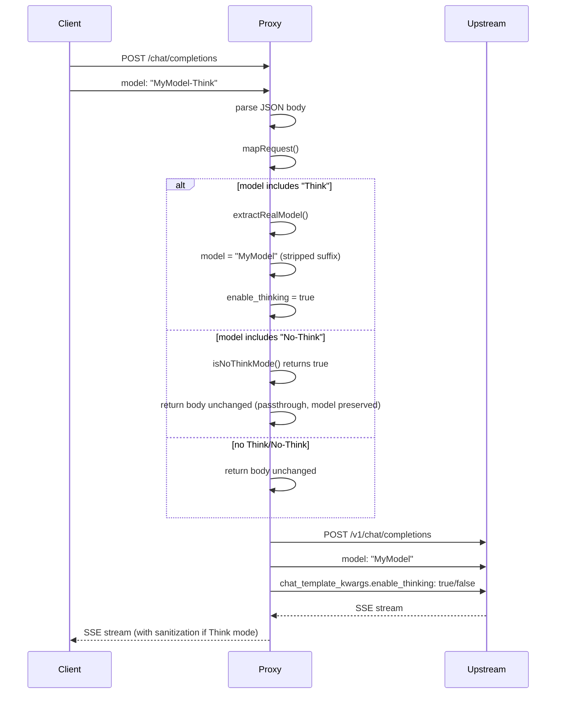

# Model Mapping Flow

## Sequence Diagram



## Step-by-Step Execution

1. **Client Request**
   - Client sends POST to `/chat/completions`
   - Request body includes `model: "MyModel-Think"`

2. **JSON Parsing**
   - `express.json()` middleware parses request body
   - Body available as `req.body`

3. **Model Mapping**
   - `mapRequest()` checks if model name includes "Think" or "No-Think"
   - `extractRealModel()` strips the suffix to get the real model name
   - If "Think": sets `enable_thinking: true` and uses real model
   - If "No-Think": returns body unchanged (passthrough)
   - No suffix: returns body unchanged (passthrough)

4. **Upstream Forwarding**
   - Request forwarded to `http://127.0.0.1:8080/v1/chat/completions`
   - Authorization header passthrough if present

5. **Streaming Response**
   - Upstream sends SSE stream
   - Proxy processes chunks in real-time
   - Filters reasoning_content and reasoning fields
   - Recovers content from reasoning if empty
   - Forwards to client

## Failure Paths

| Scenario | Behavior |
|----------|----------|
| Upstream unavailable | 500 error with `proxy_error` |
| Invalid JSON | 500 error (caught by try/catch) |
| Connection timeout | 500 error (300s timeout) |
| Client disconnect | Reader cancelled, stream stopped |

## Dynamic Model Detection

The proxy extracts the real model name dynamically from `*-Think` requests:

```
Incoming: "MyModel-Think"
  ↓
extractRealModel() removes "-Think" suffix
  ↓
Upstream: "MyModel"
```

This works for any model name:
- `Qwen3.5-35B-A3B-T-Think` → `Qwen3.5-35B-A3B-T`
- `Llama3-70B-Think` → `Llama3-70B`

For `*-No-Think` requests, the model name is passed through unchanged:
- `MyModel-No-Think` → `MyModel-No-Think` (no transformation)
